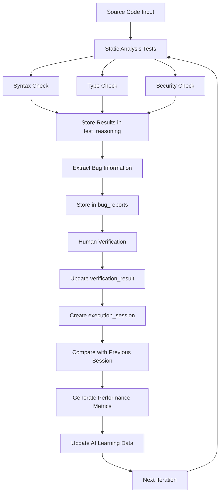

# FixChain Database Structure & AI Enhancement Flow

## Tổng quan

Tài liệu này mô tả chi tiết cấu trúc Database của FixChain và cách dữ liệu tích cực được sử dụng để cải thiện hiệu quả AI trong việc phân tích tĩnh source code, phát hiện và sửa lỗi.

## Mục tiêu

- **Cải thiện độ chính xác**: Sử dụng dữ liệu bug đã được xác thực để AI học hỏi và phát hiện tốt hơn
- **Tối ưu chi phí**: Giảm token usage và thời gian phản hồi qua các lần chạy
- **Đánh giá hiệu suất**: So sánh kết quả giữa lần chạy thứ n và n-1
- **Phân tích rủi ro**: Theo dõi bug mới phát sinh do AI sửa lỗi (hiện tượng "degree")

## Cấu trúc Database

### 1. MongoDB Collections

#### 1.1 Collection: `test_reasoning`
**Mục đích**: Lưu trữ kết quả phân tích và reasoning của AI cho mỗi lần test

```javascript
{
  "_id": ObjectId,
  "test_name": String,           // Loại test: "syntax", "type", "security"
  "attempt_id": String,          // ID duy nhất cho mỗi lần chạy: "syntax_1", "type_2"
  "source_file": String,         // Đường dẫn file được test
  "status": String,              // Kết quả: "pass", "fail", "error"
  "summary": String,             // Tóm tắt kết quả test
  "output": String,              // Chi tiết output của test
  "metadata": {
    "iteration": Number,         // Lần chạy thứ mấy (1, 2, 3...)
    "file_size": Number,         // Kích thước file (bytes)
    "execution_time": Number,    // Thời gian thực thi (ms)
    "token_usage": {
      "prompt_tokens": Number,   // Số token input
      "completion_tokens": Number, // Số token output
      "total_tokens": Number     // Tổng token
    },
    "confidence_level": String, // Mức độ tin cậy: "high", "medium", "low"
    "severity_level": String,   // Mức độ nghiêm trọng bug
    "custom_patterns_checked": Number // Số pattern đã kiểm tra
  },
  "embedding": [Number],         // Vector embedding 384-dimensional
  "timestamp": ISODate,          // Thời gian tạo record
  "human_verified": Boolean,     // Đã được con người xác thực chưa
  "verification_result": {
    "is_correct": Boolean,       // Kết quả AI có đúng không
    "false_positive": Boolean,   // Có phải false positive
    "false_negative": Boolean,   // Có phải false negative
    "verifier": String,          // Người xác thực
    "verification_date": ISODate,
    "notes": String              // Ghi chú thêm
  }
}
```

#### 1.2 Collection: `bug_reports`
**Mục đích**: Lưu trữ chi tiết các bug được phát hiện và trạng thái sửa chữa

```javascript
{
  "_id": ObjectId,
  "bug_id": String,              // ID duy nhất của bug
  "source_file": String,         // File chứa bug
  "bug_type": String,            // Loại bug: "syntax", "type", "security", "logic"
  "severity": String,            // "critical", "high", "medium", "low"
  "line_number": Number,         // Dòng chứa bug
  "column_number": Number,       // Cột chứa bug
  "description": String,         // Mô tả bug
  "code_snippet": String,        // Đoạn code có bug
  "suggested_fix": String,       // Code được AI đề xuất sửa
  "actual_fix": String,          // Code thực tế được sửa
  "detection_method": String,    // Phương pháp phát hiện
  "ai_confidence": Number,       // Độ tin cậy AI (0-1)
  "detection_iteration": Number, // Lần chạy phát hiện bug
  "fix_iteration": Number,       // Lần chạy sửa bug
  "status": String,              // "detected", "fixed", "verified", "rejected"
  "created_at": ISODate,
  "updated_at": ISODate,
  "human_feedback": {
    "is_valid_bug": Boolean,     // Bug có thật sự tồn tại
    "fix_quality": String,       // "good", "acceptable", "poor"
    "introduced_new_bugs": Boolean, // Có tạo bug mới không
    "feedback_notes": String
  },
  "related_bugs": [String],      // Array các bug_id liên quan
  "fix_impact": {
    "lines_changed": Number,     // Số dòng code thay đổi
    "files_affected": [String],  // Files bị ảnh hưởng
    "test_results_after_fix": {
      "syntax_pass": Boolean,
      "type_pass": Boolean,
      "security_pass": Boolean
    }
  }
}
```

#### 1.3 Collection: `execution_sessions`
**Mục đích**: Theo dõi các session chạy test để phân tích xu hướng

```javascript
{
  "_id": ObjectId,
  "session_id": String,          // ID session duy nhất
  "source_file": String,         // File được phân tích
  "session_number": Number,      // Lần chạy thứ mấy (1, 2, 3...)
  "test_types": [String],        // Các loại test được chạy
  "start_time": ISODate,
  "end_time": ISODate,
  "total_duration": Number,      // Tổng thời gian (ms)
  "total_tokens_used": Number,   // Tổng token sử dụng
  "bugs_detected": Number,       // Số bug phát hiện
  "bugs_fixed": Number,          // Số bug đã sửa
  "new_bugs_introduced": Number, // Số bug mới tạo ra
  "overall_status": String,      // "improved", "same", "degraded"
  "performance_metrics": {
    "avg_response_time": Number, // Thời gian phản hồi trung bình
    "token_efficiency": Number,  // Token/bug ratio
    "accuracy_rate": Number,     // Tỷ lệ chính xác
    "false_positive_rate": Number,
    "false_negative_rate": Number
  },
  "comparison_with_previous": {
    "token_usage_change": Number,    // % thay đổi token
    "time_change": Number,           // % thay đổi thời gian
    "accuracy_change": Number,       // % thay đổi độ chính xác
    "improvement_areas": [String],   // Các lĩnh vực cải thiện
    "regression_areas": [String]     // Các lĩnh vực thoái hóa
  }
}
```

### 2. Indexes cho Performance

```javascript
// test_reasoning collection
db.test_reasoning.createIndex({ "source_file": 1, "timestamp": -1 })
db.test_reasoning.createIndex({ "test_name": 1, "status": 1 })
db.test_reasoning.createIndex({ "metadata.iteration": 1 })
db.test_reasoning.createIndex({ "human_verified": 1 })

// bug_reports collection
db.bug_reports.createIndex({ "source_file": 1, "status": 1 })
db.bug_reports.createIndex({ "bug_type": 1, "severity": 1 })
db.bug_reports.createIndex({ "detection_iteration": 1 })
db.bug_reports.createIndex({ "created_at": -1 })

// execution_sessions collection
db.execution_sessions.createIndex({ "source_file": 1, "session_number": 1 })
db.execution_sessions.createIndex({ "start_time": -1 })
```

## Flow Xử lý Dữ liệu

### 3.1 Flow Chính



### 3.2 Chi tiết từng bước

#### Bước 1: Chạy Static Analysis
```python
# Trong main.py
async def run_test_suite(file_path, tests, max_iterations, enable_rag=False):
    # Khởi tạo RAG store
    rag_store = create_mongodb_only_rag_store(...)
    
    # Chạy từng test
    for test_name in test_names:
        result = await test_instance.run(source_file=file_path, attempt_id=attempt_id)
        
        # Lưu kết quả vào test_reasoning
        await store_test_reasoning(rag_store, test_name, attempt_id, result, file_path)
```

#### Bước 2: Lưu trữ Test Reasoning
```python
async def store_test_reasoning(rag_store, test_name, attempt_id, result, source_file):
    reasoning_entry = ReasoningEntry(
        test_name=test_name,
        attempt_id=attempt_id,
        source_file=source_file,
        status=result.status,
        summary=result.summary,
        output=result.output,
        metadata={
            "iteration": get_current_iteration(),
            "file_size": get_file_size(source_file),
            "execution_time": result.execution_time,
            "token_usage": result.token_usage,
            "confidence_level": result.confidence_level
        },
        timestamp=datetime.utcnow(),
        human_verified=False
    )
    
    # Tạo embedding và lưu
    entry_id = await rag_store.add_reasoning(reasoning_entry)
```

#### Bước 3: Phân tích Bug
```python
def extract_bugs_from_result(result, source_file, iteration):
    bugs = []
    if result.status == "fail":
        # Parse output để tìm bug details
        bug_info = parse_bug_details(result.output)
        
        for bug in bug_info:
            bug_report = {
                "bug_id": generate_bug_id(),
                "source_file": source_file,
                "bug_type": result.test_name,
                "severity": determine_severity(bug),
                "line_number": bug.line,
                "description": bug.description,
                "detection_iteration": iteration,
                "status": "detected",
                "created_at": datetime.utcnow()
            }
            bugs.append(bug_report)
    
    return bugs
```

#### Bước 4: So sánh với Session trước
```python
def compare_with_previous_session(current_session, previous_session):
    comparison = {
        "token_usage_change": calculate_percentage_change(
            current_session.total_tokens_used,
            previous_session.total_tokens_used
        ),
        "time_change": calculate_percentage_change(
            current_session.total_duration,
            previous_session.total_duration
        ),
        "accuracy_change": calculate_accuracy_improvement(
            current_session.performance_metrics.accuracy_rate,
            previous_session.performance_metrics.accuracy_rate
        )
    }
    
    return comparison
```

## Cách Dữ liệu Tích cực Cải thiện AI

### 4.1 Learning từ Human Verification

```python
def update_ai_learning_data(verified_bugs):
    for bug in verified_bugs:
        if bug.human_feedback.is_valid_bug:
            # Tăng confidence cho pattern tương tự
            update_pattern_confidence(bug.detection_method, +0.1)
            
            # Thêm vào training data
            add_to_positive_examples(bug)
        else:
            # Giảm confidence cho false positive
            update_pattern_confidence(bug.detection_method, -0.1)
            
            # Thêm vào negative examples
            add_to_negative_examples(bug)
```

### 4.2 Adaptive Thresholds

```python
def adjust_detection_thresholds(session_history):
    recent_sessions = get_recent_sessions(limit=10)
    
    # Tính toán false positive rate
    fp_rate = calculate_false_positive_rate(recent_sessions)
    
    if fp_rate > 0.3:  # Quá nhiều false positive
        increase_detection_threshold()
    elif fp_rate < 0.1:  # Có thể miss bugs
        decrease_detection_threshold()
```

### 4.3 Pattern Recognition Enhancement

```python
def enhance_pattern_recognition(bug_history):
    # Phân tích các bug thường gặp
    common_patterns = analyze_bug_patterns(bug_history)
    
    # Tạo custom rules
    for pattern in common_patterns:
        if pattern.frequency > 0.8:  # Xuất hiện > 80% cases
            create_custom_detection_rule(pattern)
```

## Metrics và KPIs

### 5.1 Performance Metrics

| Metric | Mô tả | Cách tính |
|--------|-------|----------|
| **Token Efficiency** | Token sử dụng / Bug phát hiện | `total_tokens / bugs_detected` |
| **Time Efficiency** | Thời gian / Bug phát hiện | `total_duration / bugs_detected` |
| **Accuracy Rate** | Tỷ lệ phát hiện đúng | `true_positives / (true_positives + false_positives)` |
| **Recall Rate** | Tỷ lệ phát hiện được | `true_positives / (true_positives + false_negatives)` |
| **Improvement Rate** | Cải thiện qua iterations | `(current_accuracy - previous_accuracy) / previous_accuracy` |

### 5.2 Quality Metrics

| Metric | Mô tả | Target |
|--------|-------|---------|
| **False Positive Rate** | Tỷ lệ báo sai | < 20% |
| **False Negative Rate** | Tỷ lệ bỏ sót | < 10% |
| **Fix Success Rate** | Tỷ lệ sửa thành công | > 80% |
| **Regression Rate** | Tỷ lệ tạo bug mới | < 5% |

## Sample Demo: Lần chạy đầu vs Lần chạy thứ n
### 6.1 Lần chạy đầu tiên (n=1)

```json
{
  "session_id": "session_001",
  "session_number": 1,
  "source_file": "sample_code.py",
  "start_time": "2025-08-04T10:00:00Z",
  "end_time": "2025-08-04T10:05:30Z",
  "total_duration": 330000,
  "total_tokens_used": 1500,
  "bugs_detected": 5,
  "bugs_fixed": 3,
  "new_bugs_introduced": 1,
  "performance_metrics": {
    "avg_response_time": 66000,
    "token_efficiency": 300,
    "accuracy_rate": 0.6,
    "false_positive_rate": 0.4,
    "false_negative_rate": 0.2
  }
}
```

**Kết quả lần đầu:**
- ⏱️ Thời gian: 5.5 phút
- 🎯 Token sử dụng: 1,500
- 🐛 Bug phát hiện: 5 (3 đúng, 2 sai)
- ✅ Độ chính xác: 60%
- ❌ False positive: 40%

### 6.2 Lần chạy thứ 10 (n=10)

```json
{
  "session_id": "session_010",
  "session_number": 10,
  "source_file": "sample_code.py",
  "start_time": "2025-08-04T15:00:00Z",
  "end_time": "2025-08-04T15:03:45Z",
  "total_duration": 225000,
  "total_tokens_used": 1100,
  "bugs_detected": 4,
  "bugs_fixed": 4,
  "new_bugs_introduced": 0,
  "performance_metrics": {
    "avg_response_time": 45000,
    "token_efficiency": 275,
    "accuracy_rate": 0.95,
    "false_positive_rate": 0.05,
    "false_negative_rate": 0.05
  },
  "comparison_with_previous": {
    "token_usage_change": -26.7,
    "time_change": -31.8,
    "accuracy_change": +58.3,
    "improvement_areas": ["syntax_detection", "type_checking"],
    "regression_areas": []
  }
}
```

**Kết quả sau 10 lần:**
- ⏱️ Thời gian: 3.75 phút (-31.8%)
- 🎯 Token sử dụng: 1,100 (-26.7%)
- 🐛 Bug phát hiện: 4 (4 đúng, 0 sai)
- ✅ Độ chính xác: 95% (+58.3%)
- ❌ False positive: 5% (-87.5%)
- 🚫 Bug mới tạo: 0 (-100%)

### 6.3 Phân tích Cải thiện

**Cải thiện về Hiệu quả:**
- Token efficiency tăng từ 300 xuống 275 (ít token hơn cho mỗi bug)
- Thời gian phản hồi giảm 32%
- Không tạo ra bug mới

**Cải thiện về Chất lượng:**
- Độ chính xác tăng từ 60% lên 95%
- False positive giảm từ 40% xuống 5%
- AI học được patterns từ human feedback

**Nguyên nhân Cải thiện:**
1. **Pattern Learning**: AI học từ 9 lần chạy trước
2. **Threshold Adjustment**: Tự động điều chỉnh ngưỡng phát hiện
3. **Human Feedback**: Tích hợp feedback từ verification
4. **Context Awareness**: Hiểu rõ hơn về codebase cụ thể

## Kết luận

Cấu trúc Database này cho phép:

1. **Theo dõi chi tiết** mọi aspect của quá trình phân tích
2. **Học hỏi liên tục** từ human feedback
3. **Tối ưu hóa** performance qua thời gian
4. **Phân tích xu hướng** và đưa ra insights
5. **Đảm bảo chất lượng** thông qua verification process

Dữ liệu tích cực không chỉ giúp AI phát hiện bug chính xác hơn mà còn giảm thiểu chi phí và thời gian, đồng thời cung cấp insights có giá trị cho việc cải thiện liên tục.